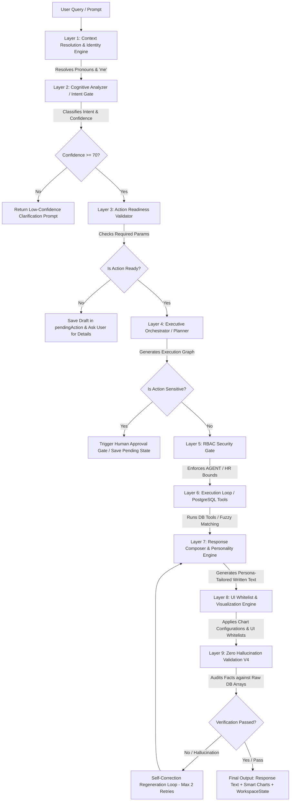

# Zorvex AI Operating System (V8 Enterprise Cognitive Core) Architecture Guide

This document provides a comprehensive, conceptual, and technical breakdown of the **Zorvex AI OS V8 Enterprise Cognitive Core**. It maps out how a user query flows from input to output, the layers involved, their responsibilities, and why they were built.

---

## 🗺️ End-to-End Query Flow Diagram

Below is the visual workflow of how a query is received, processed, validated, and returned to the client:

---

## 🛠️ Step-by-Step Layer Breakdown

### Layer 1: Context Resolution & User Identity Engine
* **What it does**: Pronoun resolution aur self-references ko real identities mein convert karta hai. Agar user kehta hai *"usko task assign karo"*, toh history aur active context se *"usko"* ko resolve kar ke real employee (e.g., "Sarah") mein convert karta hai. Agar user *"mera attendance dikhao"* bolta hai, toh current log-in `userId` se uska real profile name fetch kar ke rewrite karta hai.
* **Why it was built**: AI pichli baaton ko aur user ki apni identity ko bhool na jaye.
* **Key Benefit**: User ko baar baar poora naam ya explicit details likhne ki zaroorati nahi parti; conversation natural aur human-like rehti hai.

### Layer 2: Cognitive Analyzer (Intent Governance)
* **What it does**: System ka "Brain Router" hai. User query ko 6 distinct intents mein categorize karta hai:
  1. `INFO_LOOKUP` (data searches)
  2. `ACTION_REQUEST` (creations / updates)
  3. `ANALYTICS_REQUEST` (visual comparisons)
  4. `EXECUTIVE_REQUEST` (strategic analyses)
  5. `CONVERSATIONAL` (greeting chitchats)
  6. `SYSTEM_HELP` (help requests)
  Pehle phase mein hi confidence score check karta hai; agar confidence `< 70` ho, toh heavy execution loops ko bypass kar ke seedha clarification response de deta hai.
* **Why it was built**: Chitchat aur simple queries ke liye database queries ya complex reasoning loops ko run hone se rokne ke liye taake server performance boost ho.
* **Key Benefit**: Fast execution (Greetings aur Voice mic-checks fast-lane mein resolve ho jate hain) aur resources ki bachat.

### Layer 3: Action Readiness & Draft Memory System
* **What it does**: Check karta hai ke task ya meeting create karte waqt user ne poori parameters de di hain ya nahi. Agar parameters adhoori hain (e.g. date aur time missing hai), toh action ko database mein push karne ke bajaye temporary `pendingAction` state (draft) mein save kar leta hai aur missing info poochta hai. Agle turn mein wo missing info automatically draft parameters ke sath merge ho jati hai.
* **Why it was built**: Pehle system missing inputs par error de deta tha ya default random values ke sath record generate kar deta tha jo business flows ko kharab karta tha.
* **Key Benefit**: "Conversation Repair" fail nahi hoti; system half-baked actions ko hold kar ke parameters complete hone par hi DB mein insert karta hai.

### Layer 4: Executive Orchestrator (Multi-Tool Planner)
* **What it does**: Target goal ko achieve karne ke liye step-by-step Execution Graph taiyar karta hai. E.g., check tasks -> check leaves -> decide timeline. Isme ek "Sensitive Action Gate" bhi laga hai; agar task ya meeting salary, bonus, termination ya sensitive issues se related ho, toh system isko tab tak execute nahi karta jab tak Super Admin panel se approval na mil jaye.
* **Why it was built**: Complex corporate targets ko step-by-step resolve karne aur security auditing ke liye.
* **Key Benefit**: Multi-step plan planning and high-security compliance governance.

### Layer 5: Role-Based Access Control (RBAC) Security Gate
* **What it does**: Query execute hone se pehle user ke actual role ki boundaries verify karta hai. 
  - **AGENT**: Apne assigned clients, leads aur tasks ke bahar ka data nahi dekh sakta (automatic `assignedToId: userId` injection). Salary aur dusre agents ka details hide ho jata hai.
  - **HR**: Enterprise finance dashboards aur executive strategic graphs se blocked hai.
  - **ACCOUNTANT**: Logistics calendars aur operational schedules se blocked hai.
* **Why it was built**: True corporate data isolation aur security leaks ko prevent karne ke liye.
* **Key Benefit**: Strict data privacy and zero unauthorized internal data access.

### Layer 6: Execution Loop & PostgreSQL DB Tools
* **What it does**: PostgreSQL database tools aur services ko execute karta hai. Isme fuzzy-matching logic laga hai jo agar assignees ke spelling mein farq ho toh low similarity par `CONFIRMATION_REQUIRED` error return karta hai taake wrong assignments na hon. Proximity map fallback bhi isi layer par hota hai (e.g. agar Dubai Marina mein listing na mile, toh adjacent JBR aur JLT areas automatically search ho jate hain).
* **Why it was built**: Direct PostgreSQL connection aur database consistency rules maintain karne ke liye.
* **Key Benefit**: Robust database writes and intelligent adjacent listing fallbacks.

### Layer 7: Response Composer & Personality Engine
* **What it does**: Mode-specific formatting and tone generator (50% ChatGPT, 25% EA, 15% BA, 10% COO).
  - `LOOKUP MODE`: Strictly facts and lists. No consulting advice.
  - `ACTION MODE`: Direct confirmation parameters.
  - `ANALYTICS & EXECUTIVE MODES`: Strategic SWOT, risks, opportunities, aur recommendations alignments.
  Yeh Roman Urdu aur English donon ko mirror karta hai aur corporate consult-speak jargon ("To align with your business goals...") ko automatic banish karta hai.
* **Why it was built**: AI responses ko concise, readable aur less robotic banane ke liye.
* **Key Benefit**: High-quality visual outputs and professional executive readability.

### Layer 8: UI Whitelist & Visualization Decision Engine
* **What it does**: Har response ke content aur intent ke mutabiq frontend cards and charts define karta hai. Attendance queries par sirf attendance cards whitelist hote hain aur trend data ke mutabiq dynamic chart config (`line_chart`, `pie_chart`, `bar_chart`) metadata attach ho jata hai jo Next.js dashboard widgets mein render hota hai.
* **Why it was built**: UI relevancy maintain rakhne ke liye taake agar user leaves dekh raha ho toh user profile ya task cards screen par clutter na karein.
* **Key Benefit**: Clean dashboard presentation and automatic interactive data visualization.

### Layer 9: Zero Hallucination Validation Engine V4
* **What it does**: AI ke generated response text ko raw database queries ke outputs se line-by-line compare karta hai. Agar database mein 0 records hain aur response mein AI ne 2 items fabricate kiye hain, toh is layer pe validation fail ho jati hai aur system automatically correction instructions ke sath response regenerate karta hai (max 2 retries).
* **Why it was built**: AI hallucinations aur fake data calculations ko 100% block karne ke liye.
* **Key Benefit**: Factual accuracy and production-grade trust boundaries.

---

## 🚀 Comparison Summary: Old Chatbot vs. Zorvex AI OS V8

| Feature | Old Chatbot (V5/V6) | Zorvex AI OS V8 Enterprise |
| :--- | :--- | :--- |
| **Context Awareness** | Generates responses turn-by-turn. Forgets entities. | Active Context layer inherits topic state recursively. |
| **Identity Resolution** | Treats "me" as raw string or defaults to system role. | Retreives login context, rewrites queries using real names. |
| **Data Security** | Bypassed client limits (Agents could view admin logs). | Strict role restrictions, AGENT filters injected in raw queries. |
| **Hallucination Control** | Confidently outputted wrong record counts. | Audits text response against raw DB lists before returning. |
| **Failed Retrievals** | Gave consulting advice on how to get more data. | Concise, professional data lookup failure report. |
| **UI Presentation** | Renders multiple cards at once (clutters dashboard). | Whitelisted single UI widgets with dynamic smart charts. |
